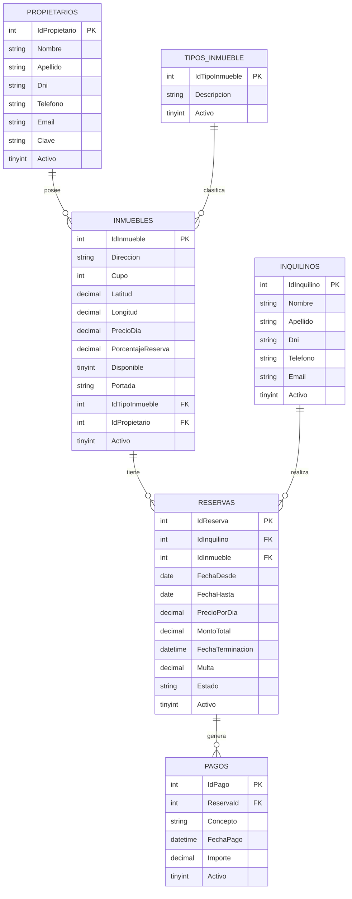

# Proyecto Inmobiliaria

> Aplicación web para la gestión de reservas temporales de una inmobiliaria, desarrollada con ASP.NET Core MVC y ADO.NET.

---

## 👥 Integrantes del Grupo

* **Enzo Miranda** - *enzo792015@gmail.com* - [@Enzo](https://github.com/Enzo)

---

## 📐 Modelado de Datos

A continuación se presenta el esquema del modelo de datos correspondiente a la aplicación (Diagrama Entidad-Relación):

### Diagrama Entidad-Relación (DER)

---

## ⚙️ Instrucciones para levantar la base de datos

1. Abre tu gestor de base de datos MySQL (por ejemplo, phpMyAdmin o MySQL Workbench).
2. Asegúrate de tener el servicio de MySQL en ejecución (por ejemplo desde el panel de control de XAMPP).
3. Ejecuta el script `inmobiliaria.sql` provisto en la raíz de este repositorio. Esto creará la base de datos `inmobiliaria`, las tablas correspondientes (`Propietarios`, `Inquilinos`, `TiposInmueble`, `Inmuebles`, `Reservas`) y cargará datos de prueba.
4. Verifica que la cadena de conexión en el archivo `appsettings.json` coincida con las credenciales de tu servidor MySQL local (por defecto `Server=localhost;Database=inmobiliaria;User=root;Password=;`).
