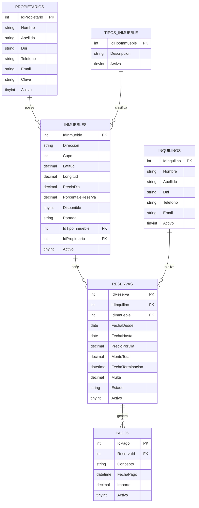

# Proyecto Inmobiliaria

> Aplicación web para la gestión de reservas temporales de una inmobiliaria, desarrollada con **ASP.NET Core MVC** y **ADO.NET (MySqlConnector)**.

---

## 👥 Integrantes del Grupo

* **Enzo Miranda** - *enzo792015@gmail.com* - [GitHub](https://github.com/EnzoM35)

---

## 📋 Requisitos Previos

Antes de ejecutar la aplicación, asegúrate de contar con:
* [.NET 10 SDK](https://dotnet.microsoft.com/download) (o la versión compatible de .NET instalada).
* Servidor **MySQL** (mediante [XAMPP]).


---

## 📐 Modelado de Datos

A continuación se presenta el esquema del modelo de datos correspondiente a la aplicación (Diagrama Entidad-Relación):

### Diagrama Entidad-Relación (DER)



---

## ⚙️ Instrucciones para levantar la Base de Datos

1. Abre tu gestor de base de datos MySQL (por ejemplo, **phpMyAdmin**).
2. Asegúrate de tener el servicio de MySQL en ejecución (iniciando el módulo MySQL en el panel de **XAMPP**).
3. Ejecuta el script [`inmobiliaria.sql`](inmobiliaria.sql) ubicado en la raíz de este proyecto.
   * Este script creará automáticamente la base de datos `inmobiliaria`, todas las tablas (`Propietarios`, `Inquilinos`, `TiposInmueble`, `Inmuebles`, `Reservas`), relaciones/claves foráneas y cargará los datos iniciales de prueba.
4. Verifica que la cadena de conexión en el archivo `appsettings.json` coincida con las credenciales de tu servidor MySQL local:
   ```json
   {
     "ConnectionStrings": {
       "MySql": "Server=localhost;Database=inmobiliaria;User=root;Password=;"
     }
   }
   ```
   *(Si tu usuario o contraseña de MySQL son diferentes, ajústalos en `appsettings.json`)*.

---

## 🚀 Instrucciones para ejecutar el Proyecto

1. Clona el repositorio:
   ```bash
   git clone https://github.com/EnzoM35/InmobiliariaULP_EnzoMiranda.git
   cd InmobiliariaULP_EnzoMiranda
   ```

2. Restaura las dependencias y paquetes NuGet:
   ```bash
   dotnet restore
   ```

3. Ejecuta la aplicación en modo desarrollo:
   * **Modo estándar:**
     ```bash
     dotnet run
     ```
   * **O con recarga en caliente (Hot Reload):**
     ```bash
     dotnet watch
     ```

4. Abre tu navegador web y navega a la URL indicada en la consola (por ejemplo, `http://localhost:5207`).

---

## 📌 Módulos y Funcionalidades Disponibles

* **Propietarios:** ABM completo y listado.
* **Inquilinos:** ABM completo y listado.
* **Tipos de Inmueble:** ABM completo y vista de detalles.
* **Inmuebles:** ABM completo, filtrado, subida de portada, coordenadas/mapa y vista detallada.
* **Reservas:** ABM completo, cálculo automático de importes por estadía, validación de fechas/inmuebles disponibles y vista detallada.
