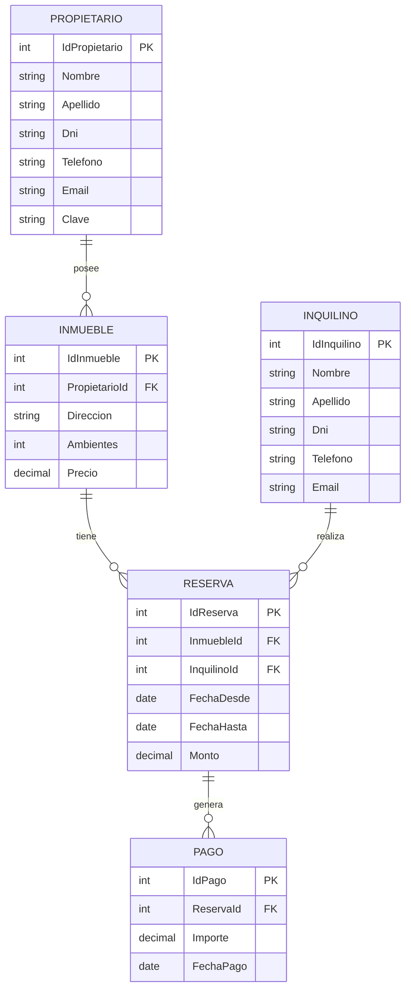

# Proyecto Inmobiliaria

> Aplicación web para la gestión de reservas temporales de una inmobiliaria, desarrollada con ASP.NET Core MVC y ADO.NET.

---

## 👥 Integrantes del Grupo

* **Enzo** - **enzo792015@gmail.com** - [@Enzo](https://github.com/Enzo)

---

## 📐 Modelado de Datos

A continuación se presenta el esquema del modelo de datos correspondiente a la aplicación (Diagrama Entidad-Relación):

### Diagrama Entidad-Relación (DER)

---

## ⚙️ Instrucciones para levantar la base de datos

1. Tener el motor MySQL en ejecución PhpMyAdmin.
3. Ejecuta el script `inmobiliaria.sql` provisto en la raíz de este repositorio. Esto creará la base de datos `inmobiliaria` y las tablas necesarias.
4. Actualiza la cadena de conexión en el archivo `appsettings.json` o usando `dotnet user-secrets` con tu usuario y contraseña de MySQL.
